# QTWin11

QTWin11 is a template to customize win32 apps using QT with dark/light mode and Mica material.

## Features
- This template uses the system accent color
- System dark and light mode
- Used Mica material on win32 apps 

## Installing
```pwsh
pip install PySide2
```
```pwsh
pip install win32mica
```
```pwsh
pip install darkdetect
```
## Requirements
- Windows 11

## Screenshots
<p align="center">
  <b>
Dark Theme
</b>
</p>

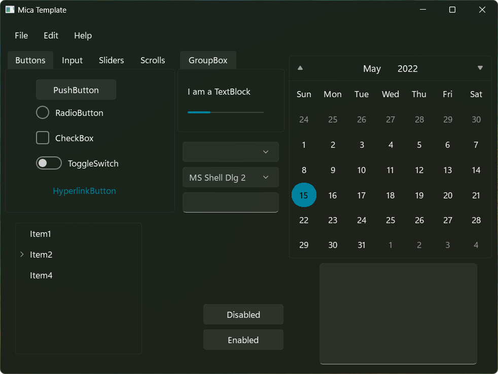

<p align="center">
  <b>
Light Theme
</b>
</p>

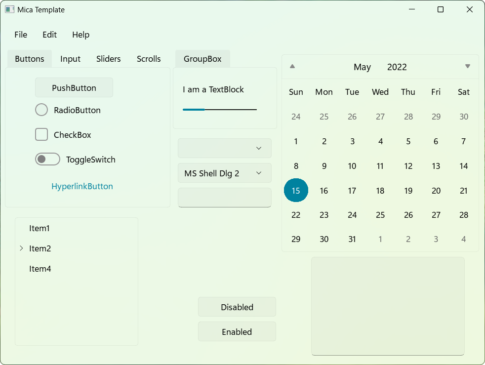


<p align="center">
  <b>
Dark | Light
</b>
</p>

<p align="center">
  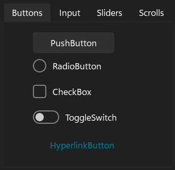
&nbsp; &nbsp; &nbsp; &nbsp;
  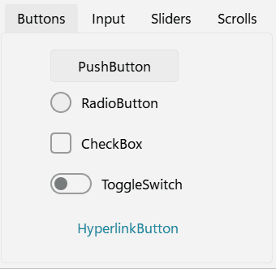
</p>
<p align="center">
  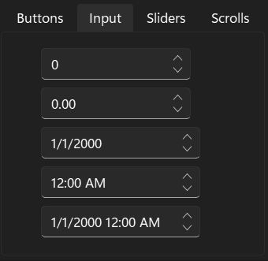
&nbsp; &nbsp; &nbsp; &nbsp;
  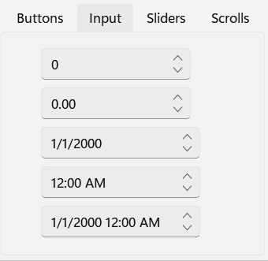
</p>
<p align="center">
  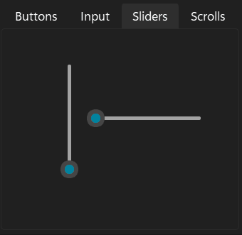
&nbsp; &nbsp; &nbsp; &nbsp;
  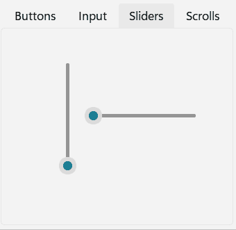
</p>
<p align="center">
  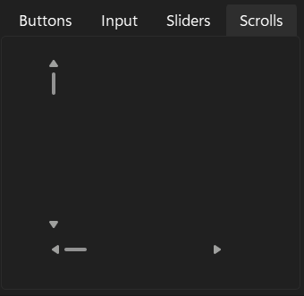
&nbsp; &nbsp; &nbsp; &nbsp;
  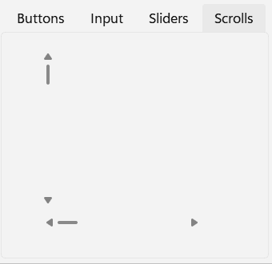
</p>
<p align="center">
  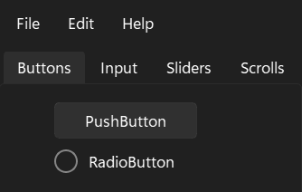
&nbsp; &nbsp; &nbsp; &nbsp;
  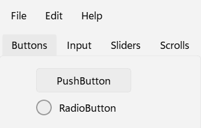
</p>


## What's next?
**Plans for the near future**
- Refine QTreeWidget
- Refine popup menu of QComboBox and QFontComboBox
- Apply mica for QMenu in QCalendarWidget