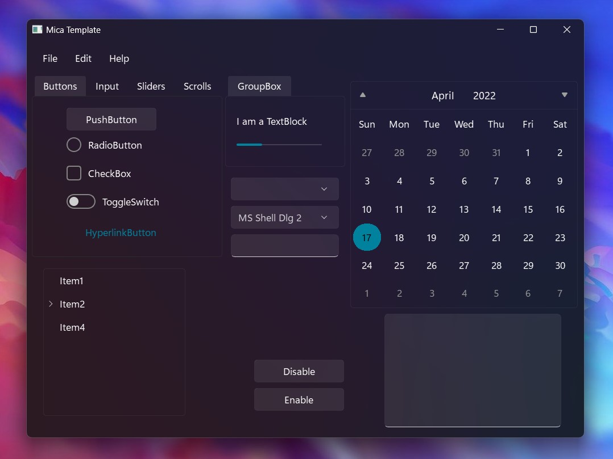
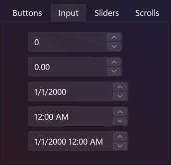
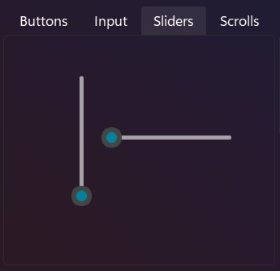
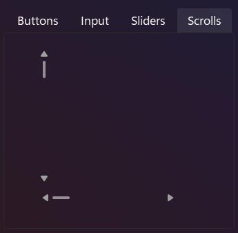
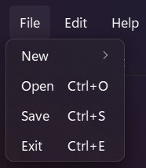

# QTWin11
QTWin11 is a template to customize win32 apps using QT. 

## Installing
```pwsh
pip install PySide2
```
```pwsh
pip install win32mica
```
```pwsh
pip install darkdetect
```
## Requirements
- Windows 11

## Screenshots
**Now there's only a dark theme**












## What's hext?
**Plans for the near future**
- it's planned to make light theme support
- Refine QTreeWidget
- Refine popup menu of QComboBox and QFontComboBox
- Apply mica for QMenu in QCalendarWidget
